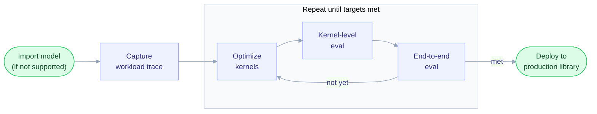

# Optimizing a model with fastkernels → production library (e.g. vLLM/SGLang)

Quick-start for porting a new model into fastkernels, optimizing its kernels against a SOTA reference (vLLM or SGLang), and shipping the winners back.

## Quick Start

```bash
git clone https://github.com/Snowflake-AI-Research/fastkernels.git
cd fastkernels
pip install .
```

---

## Workflow



---

### 1. Import model (if not yet supported) into fastkernels

You can list the supported models with `fastkernels list`. If the new model is not yet supported by fastkernels, you can import it using a reference implementation from a production framework such as vLLM or SGLang. We have created the following agentic skills to import the model, validate its correctness, and ensure that the baseline performance is on par with the reference production framework. 

Please clone the reference framework on your machine, then run these `/`-skills in a Claude Code session (reference lib = whichever is SOTA):

```
/fastkernels-add-model zai-org/GLM-5.2 using <path to vllm/sglang> as reference   # port arch + L1–L3 ops from reference
/fastkernels-bench-ops zai-org/GLM-5.2 against <path to vllm/sglang>              # each op: correct + perf >= reference lib
/fastkernels-check-parity  zai-org/GLM-5.2 against <path to vllm/sglang>          # adversarial mismatch/shortcut hunt → fix
/fastkernels-validate-e2e  zai-org/GLM-5.2                                # runs validate: align + speedup
```

**Outcome:** The agent will create `fastkernels/tasks/baseline/L4/<model name>.py` (+ its L1–L3 ops), matching the reference's interface and parameters. The imported model will output the same tokens (or other output tensor, depending on the model type) as the reference library and its end-to-end performance (throughput/latency) in fasterkernels will be on par with the reference, both in the eager and compiled/cuda graph scenarios.

### 2. Capture a workload trace

After importing the model, the next step is to capture a trace by running the model with one or more representative workloads. A *workload* is the regime a model is exercised under — the prompt mix, batch size, resolution, sequence lengths, etc. fastkernels ships several default workloads for each model family. List them with:

```bash
fastkernels list --workloads
```

This prints a table of available workloads showing their exact `Family.member` name (e.g. `LLM.mixed`, which you can use directly in a scenario's `workloads:` list), the backing dataset, and their defining characteristics (suitability for Throughput vs. Latency testing, along with parameters like batch size or resolution). You can reuse any of these, or add a new one.

<details>
<summary><b>Adding a new workload</b></summary>

Workloads are defined in `fastkernels/workloads.py`, which is the single source of truth for their identity, purpose, and parameters. To add one:

1. **Declare the workload identity.** Add a member to the relevant per-family enum (`LLM`, `VLM`, `Diffusion`, …). The member *name* (left of the `=`) is the token you use in scenario YAML (`LLM.<name>`); its *value* (the string) is the canonical runtime name shown in outputs:

```python
class LLM(Workload):
    mixed = "mixed"
    long_context = "long-context"
    code_gen = "code-gen"          # <- new workload
```

2. **Give it a purpose and parameters.** Every workload must resolve to a throughput or latency purpose — there are two ways, depending on the family:
   - **Families with parameter specs** (LLM, VLM, ASR, Diffusion, … — anything in `_SPEC_SOURCES`): add a `*ThroughputWorkload` / `*LatencyWorkload` entry to that family's `*_THROUGHPUT_WORKLOADS` / `*_LATENCY_WORKLOADS` list. Its `name=` **must equal the enum member's value** (`"code-gen"`) — that is how the registry joins the identity to its params:

```python
THROUGHPUT_WORKLOADS: list[ThroughputWorkload] = [
    ThroughputWorkload("mixed", num_requests=1000, ...),
    ThroughputWorkload("long-context", num_requests=64, ...),
    ThroughputWorkload("code-gen", num_requests=500, dataset_name="...", decode_cap=512),  # new
]
```

   - **Param-less families** (Robotics, Recsys, Rendering, …): add the member directly to `_PARAMLESS_PURPOSES` with its `Purpose`:

```python
_PARAMLESS_PURPOSES = {
    ...
    Recsys.my_new_workload: Purpose.THROUGHPUT,
}
```

   If you skip this step, `_build_workload_specs()` raises at import time (`Workloads missing a purpose/spec: [...]`), so a misconfigured workload fails loudly rather than silently.

3. **Wire up any dataset or runner it needs.** If the workload draws real data (e.g. a new LLM prompt set), register its dataset — for the LLM family, add entries to `DEFAULT_WORKLOAD_DATASETS` / `DEFAULT_DECODE_CAPS`, and make sure the family's bench harness knows how to run it. Pure shape workloads (fixed resolution/batch) need nothing further.

4. **Use it in a scenario.** Reference the new workload from a scenario YAML in `fastkernels/scenarios/` by its `Family.member` token:

```yaml
scenarios:
  - model: meta-llama/Llama-3.1-8B-Instruct
    tp: 1
    dtype: bfloat16
    workloads: [LLM.mixed, LLM.code_gen]
```

5. **Verify.** Run `fastkernels list --workloads` and confirm the new workload appears in the table with its dataset and characteristics displayed correctly.

</details>

To capture the shapes, dtypes, and strides for a workload, you run `fastkernels capture` passing a scenario YAML config. A scenario config file defines the specific model, tensor parallel degree (`tp`), data type (`dtype`), and the array of workloads to execute. The capture tool runs the model end-to-end on these workloads, instruments every operator, and records exactly what tensors were passed to each operator during execution.

You can inspect the existing scenario configs in [`fastkernels/scenarios/`](../scenarios/).

<details>
<summary><b>Scenario YAML Example</b></summary>

```yaml
scenarios:
  - model: zai-org/GLM-5.2
    tp: 8
    dtype: bfloat16
    workloads: [LLM.mixed, LLM.long_context]
```
</details>

Run the capture command:

```bash
fastkernels capture fastkernels/scenarios/glm5.2.yaml --max-layers 4 --max-requests 64
```

**stdout** (per scenario·workload; parallel across GPUs, one scenario at a time at `tp=8`):
```text
Discovering operators in fastkernels.tasks.baseline ...
  Instrumented 583 operator class(es).

########## Scenario: zai-org/GLM-5.2 (dtype=bfloat16, tp=8) ##########
  [1/6] Loading model weights...
  NOTE: --max-layers capping transformer layers 92 -> 4
  [1/6] Model loaded in 12.7s
  [4/6] Allocating KV cache...
  Engine ready in 41.2s total

=== Capturing workload: mixed ===
Loading 'mixed' workload prompts (64) ...
  Generation: 61/64 reached EOS; lengths=[228, 577, 43, ...]
  Verification 1 (hook cross-check)   [PASS]: 19/19 operator forwards match the capture.
  Verification 2 (mock batching replay) [PASS]: 5/5 checks passed (312 simulated steps).
  Captured 20 executed operator class(es) (of 583 instrumented).
  Report written to ~/.fastkernels/captures/zai-org__GLM-5.2_tp8_bfloat16_mixed_req64_seqsauto_L4_eager.json
```

One JSON report is written per scenario·workload. This JSON records every executed operator's init/forward parameters and inputs. Drop `--max-layers`/`--max-requests` if you want a full-fidelity capture rather than a truncated run.


### 3. Optimize the kernels

After capturing the shapes, it's time to optimize performance. fastkernels allows you to do that by replacing the model's baseline operators with optimized versions. To optimize an operator, create a candidate file at the path: `fastkernels/tasks/candidate/<operator level>/<operator_name>.py`. Each candidate will need to have the exact same interface (init/forward signature) as its corresponding baseline operator. You can write one or more such candidates, each with the optimized kernel code. 

To facilitate this step, you can use `fastkernels list --map` to list all operators used by a given model. You can then use `fastkernels create-stubs` to automatically create empty stub candidates for a particular model's operators:

```bash
fastkernels create-stubs --architecture glm5_2   # arch = L4 stem from step 2
```

**Output:** empty candidate modules in `fastkernels/tasks/candidate/L{1..4}/*.py`, one per
operator. Hand them to a coding agent to implement — point it at the step-2 capture JSON for the
exact target shapes/dtypes — then benchmark each with step 4. (There is no skill for authoring
candidates; that is the agent's job.)

### 4. Benchmark at the kernel level (from the capture) — iterate

```bash
fastkernels bench --target moe_grouped_gemm --self-test   # harness sanity (~1.0x)
fastkernels bench --target moe_grouped_gemm               # baseline vs candidate
```

**Output:**
```text
  OP                     SHAPES  CORRECT  BASELINE   CANDIDATE  SPEEDUP
  moe_grouped_gemm            7  OK       412 µs     287 µs     1.44x
```
Not faster / not correct → edit the candidate and re-run. Iterate to `SPEEDUP > 1.0x`.

### 5. Evaluate end-to-end (correctness + perf + cuda-graphs)

```bash
fastkernels eval fastkernels/scenarios/glm5.2.yaml --max-layers 4 --max-requests 64
```

**Output** — baseline-vs-candidate summary per scenario (CUDA graphs on; add
`--enforce-eager` to compare eager). `IN=var` since real prompts vary; `MATCH` is exact
token-id agreement:
```text
==========================================================================================
  THROUGHPUT SUMMARY   zai-org/GLM-5.2 (tp=8)   correctness: PASS
==========================================================================================
  SCENARIO          SEQS    IN   OUT  BASELINE tok/s  CANDIDATE tok/s  SPEEDUP     MATCH
  ------------------------------------------------------------------------------------------
  mixed               64   var   390           9,102           11,540    1.27x     64/64
  long-context        64   var   256             341              402    1.18x     64/64
==========================================================================================

==============================================================================================
  LATENCY SUMMARY
==============================================================================================
  SCENARIO             BS   OUT  ITERS  BASELINE med  CANDIDATE med  SPEEDUP
  ----------------------------------------------------------------------------------------------
  single-request        1   128      5       0.0412s        0.0341s    1.21x
  fixed-batch-32       32   128      5       0.7620s        0.6903s    1.10x
==============================================================================================
```
Run `--self-test` first (candidate = baseline → `100%` match, `~1.0x`) to sanity-check the
harness. Correctness must stay `PASS`. (The analogous FASTKERNELS-vs-vLLM table is what
step 1's `/fastkernels-validate-e2e` prints.)

### 6. Ship the winners into vLLM/SGLang

The candidates were written to the reference op's exact interface (steps 1 & 4), so they're
drop-in — copy each validated kernel back:

```bash
cp fastkernels/tasks/candidate/L2/moe_grouped_gemm.py \
   /home/yak/reference_code/sglang/python/sglang/srt/layers/moe/<file>.py
```

Re-run the reference's own tests to confirm parity, then upstream.

---

**Loop:** steps 3→4→5 until the kernel and e2e speedups hold with `correctness: PASS`.
`--max-layers`/`--max-requests` keep every loop cheap; run the full config once before shipping.
